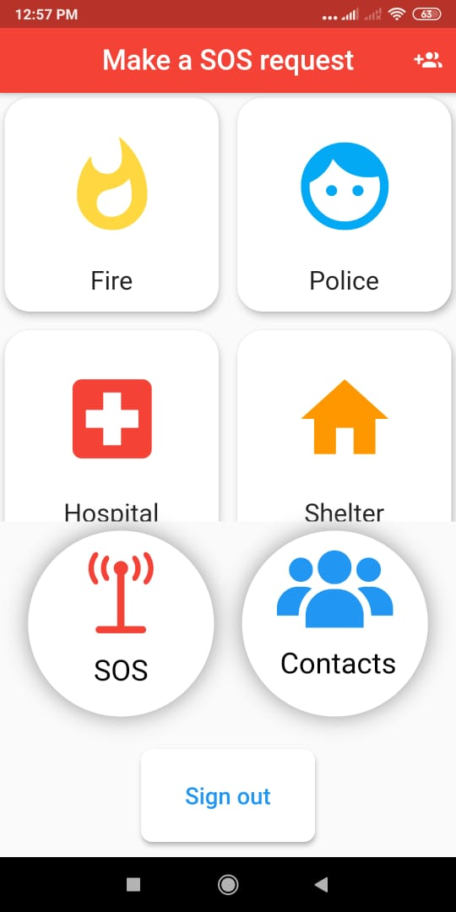
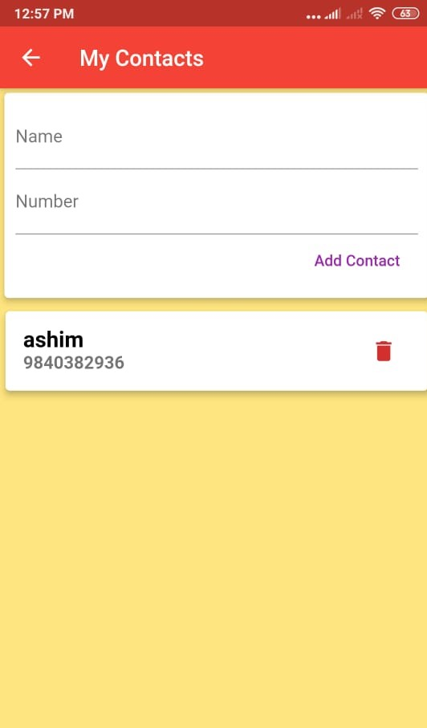
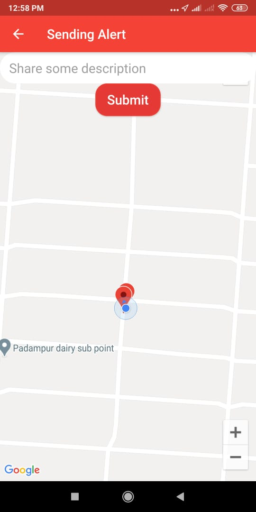
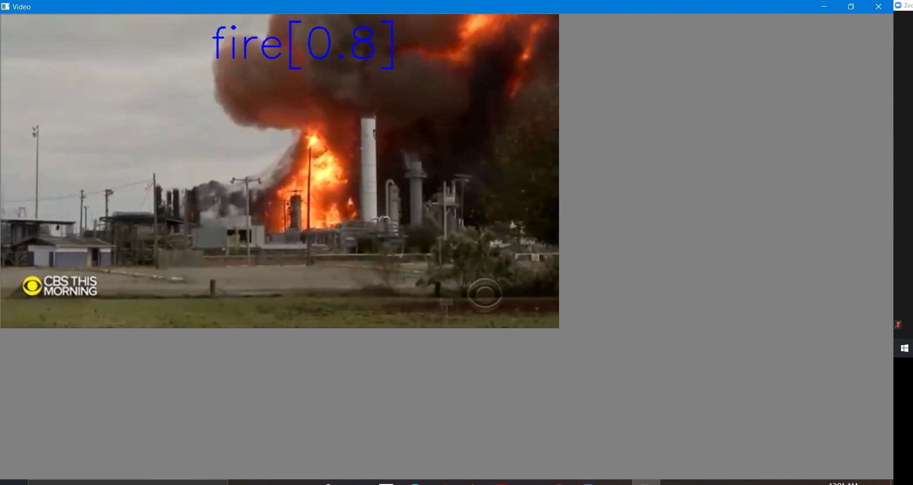
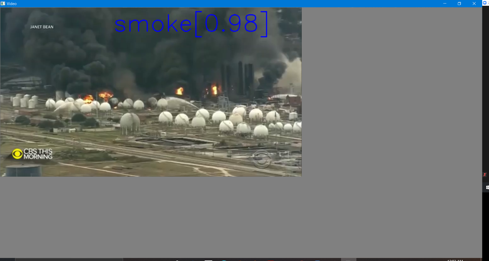

# NASA_Hackathon2020

# Better Together
Click [here](https://www.youtube.com/watch?v=LYBaioS2f00&feature=youtu.be&ab_channel=TowardsAI) for video

This project uses several APIs in order to ask for help with people nearby or contact your local authorities.There are three major features:

Sending an SOS messege to people nearby you.
To contacts button that would send the message to your contacts about your location.
Contacting to the nearest authority.

Main aim of this project is to spread the alert quickly among the large amount of people in the certain areas.

Suppose the fire is going to take place in the building, now lets suppose someone in the building saw that fire is changing its status, like growing bigger and bigger so what he can do is open the app and all he needs to do is one click, then all the peoples in the building will get alert notification, by this we can quickly and before the fire takes it massive appearence, we can empty the building and hence saving the lives.

This project doesn't only stop here, suppose Earthquake measuring center got the information from the computer that there will going to occur a earthquake after 20 seconds (Its might be like impossible to predict early on but lets suppose) then just by one tab or one click they can notify or say alert peoples who are within specified radius(Eg:10km) from the office, and peoples who ever got this notification again by one tab can sent the same notification to other peoples who are within specified radius from them, by this we can notify or alert the whole town at once. It might be different in real case scenario because earthquake is so suddenness activity its like a snap, it will just happen but the main idea is we can connect while town with just a one click.

lets' dive into the app

If you want to see how our login and signup page looks like then [click here](https://github.com/ashish807/NASA_Hackathon2020/tree/main/Images)

Our app home screen looks like:

So here you can see different buttons, 'Fire' button will give you the nearest fire brigade number similarly 'Police' button will give you the nearest police telephone number and Similar thing goes to 'Hospital'. All of these buttons calls their respective APIs

If you look to the upper right corror of the home screen will see logo of two people and a + sign, if you click on that you will get something like:

Now here you can add your contacts, accodring to, to whom you want to sent the trouble message when your are in trouble.

Now the real magic is inside the 'SOS' button as soon as you click on the 'SOS' button you will get something like:

Here you can see location of the all the users, and a message box where you can type some messages like 'Help me I am in trouble'or'Fire is going to take place', as soon as you click the submit button, people around 20km from you will get the notification of your alert and message you typed.

And in the Home page you can also see a 'Contacts' button, so what it does is, it will sent the notification to  only those who are in your contact list

Plus we have created a Fire Detection model, which will automatically alert the peoples.

But you may ask why do we even need the fire detection model in this project?, and the answer is, so far in order to alert peoples regarding the fire or say any other disasters, we assume that there is a person who is seeing that disasters happening live or get some scence that something bad is going to happen, then only he will sent alert to others,
but what if nobody is seeing that disasters taking its massive or aggresive apperance then our Apps does not help to save lives right? So we thought,  why don't we allow machine to handle all of these stuff, I mean let machine decide when to send alert, so there shouldn't necessary be presence of human in order to send alert messages. So we built a Fire detection Machine Learning model which will detect fire and smoke. So idea here is machine will detect the fire and sends the alert message accordingly, and good factor about this model is, it can even detect the smoke so this also can send alert message when it detect smoke. So by this we can empty the building before fire takes place and we can use 
Fire extinguisher in time and prevent from massive fire to happen and saves the money and lives at the same time

Please [click Here](https://www.youtube.com/watch?v=LYBaioS2f00&feature=youtu.be&ab_channel=TowardsAI) for more details
